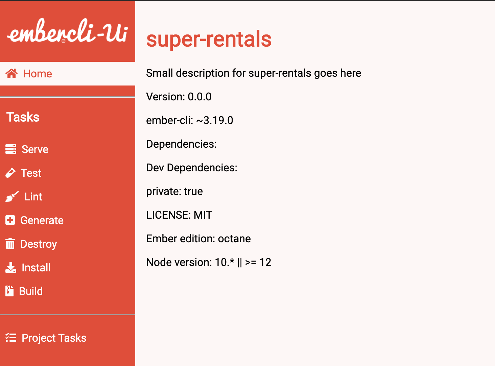
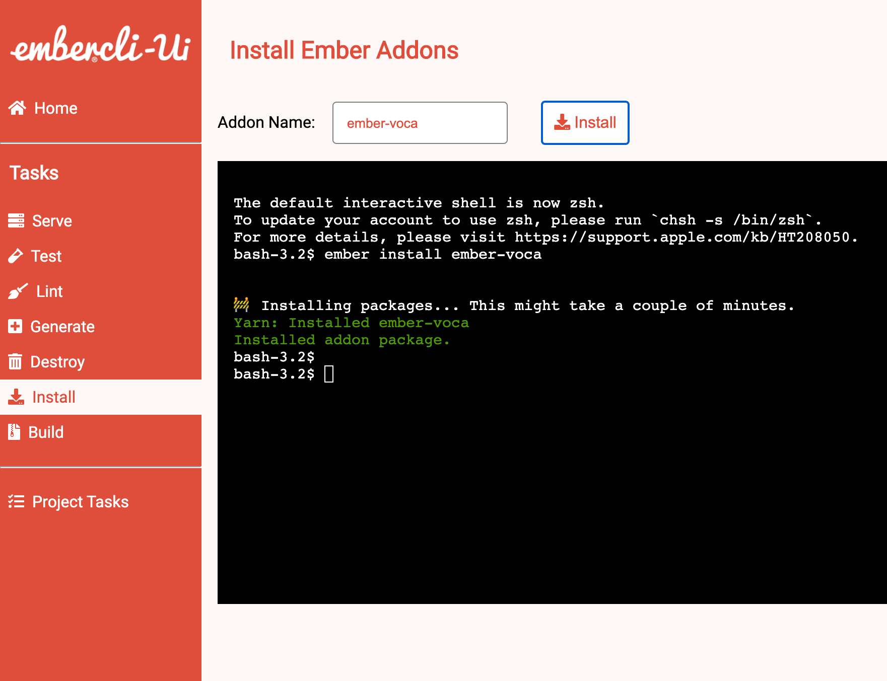
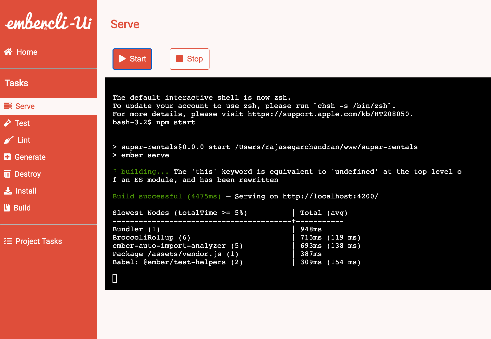
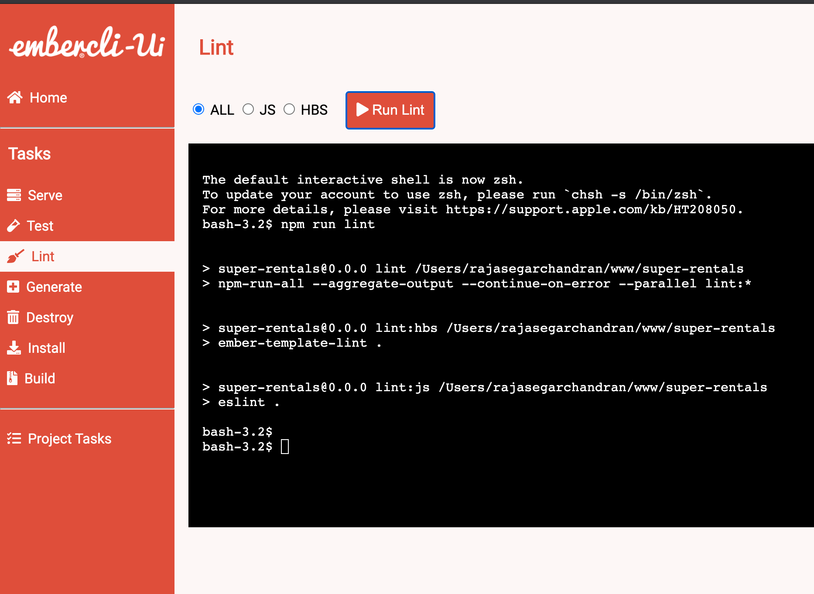
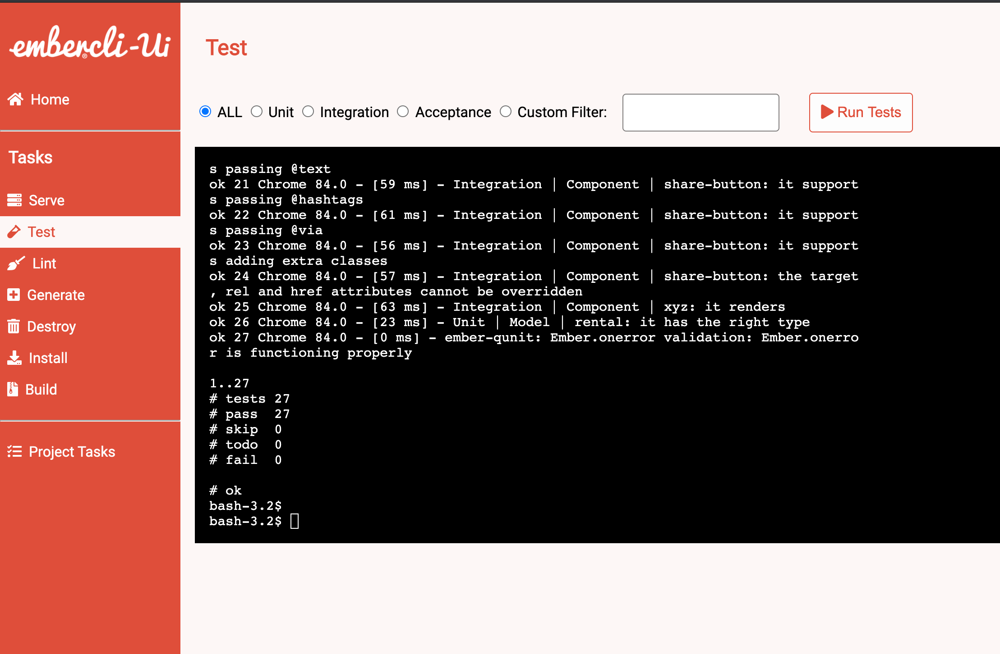
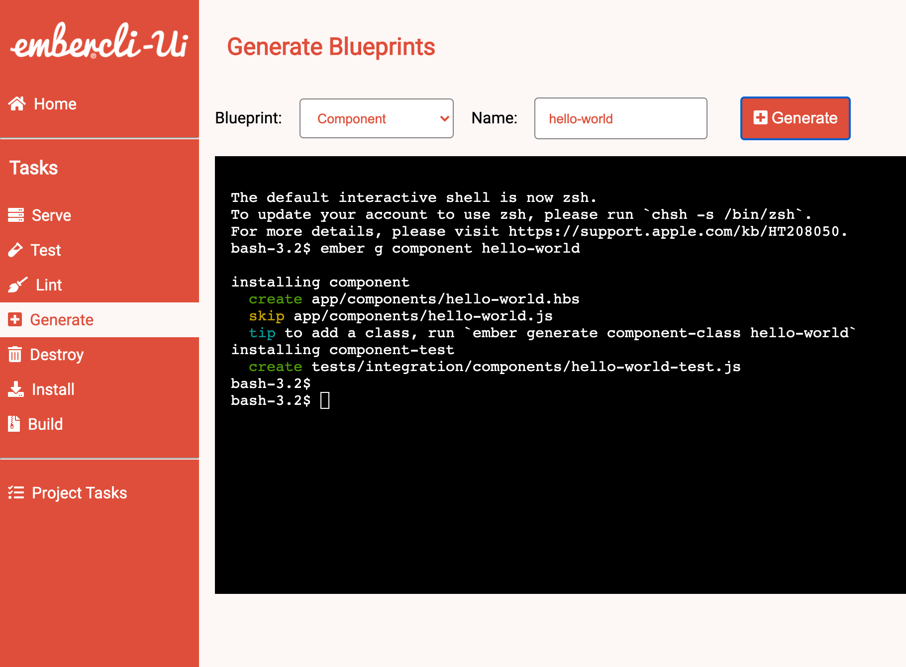
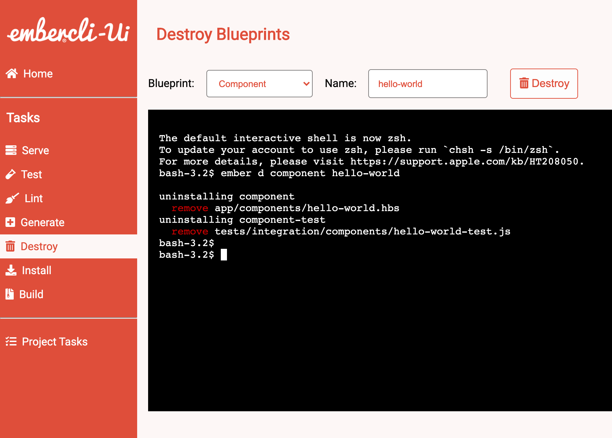
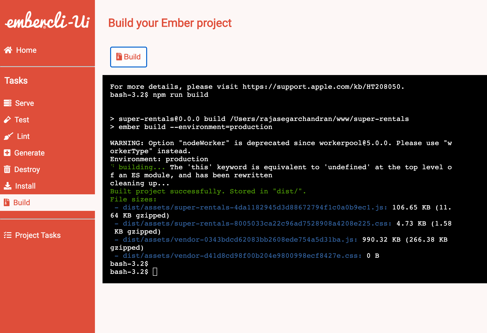
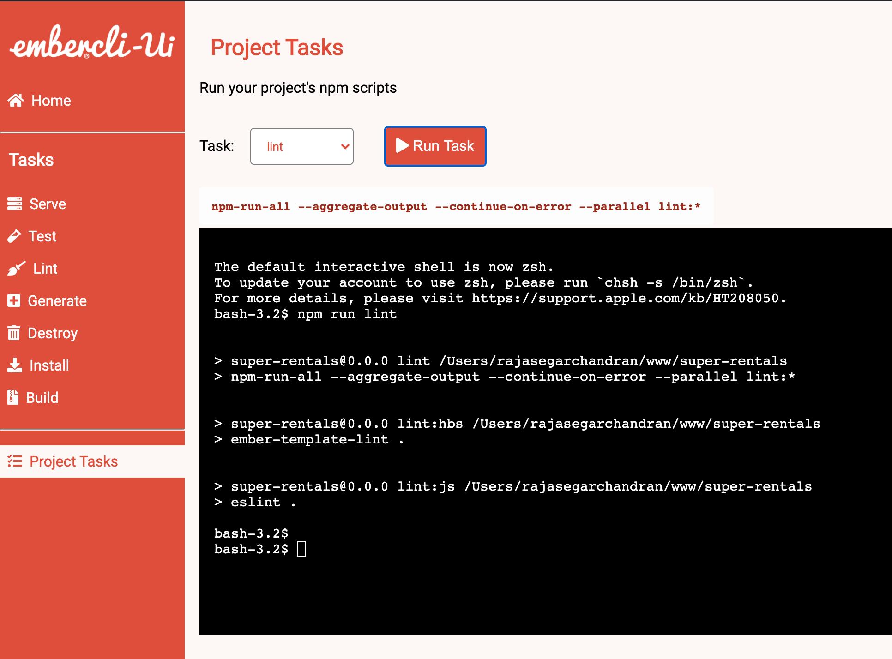

# ember-cli-ui

[ember-cli](https://cli.emberjs.com/release/) in the browser to create and manage your
Ember projects using GUI

## Installation

* `npm install -g ember-cli-ui`

## Running / Development

* `ember-cli-ui`

The CLI will be automatically open a new browser window and serve from an available port.

## Screenshots
### Home page

### Install page

### Serve page

### Lint page

### Test page

### Generate page

### Destroy page

### Build page

### Project tasks page

## Prerequisites

You will need the following things properly installed on your computer.

* [Git](https://git-scm.com/)
* [Node.js](https://nodejs.org/) (with npm)
* [Ember CLI](https://ember-cli.com/)
* [Google Chrome](https://google.com/chrome/)

## Further Reading / Useful Links

* [ember.js](https://emberjs.com/)
* [ember-cli](https://ember-cli.com/)
* Development Browser Extensions
  * [ember inspector for chrome](https://chrome.google.com/webstore/detail/ember-inspector/bmdblncegkenkacieihfhpjfppoconhi)
  * [ember inspector for firefox](https://addons.mozilla.org/en-US/firefox/addon/ember-inspector/)
